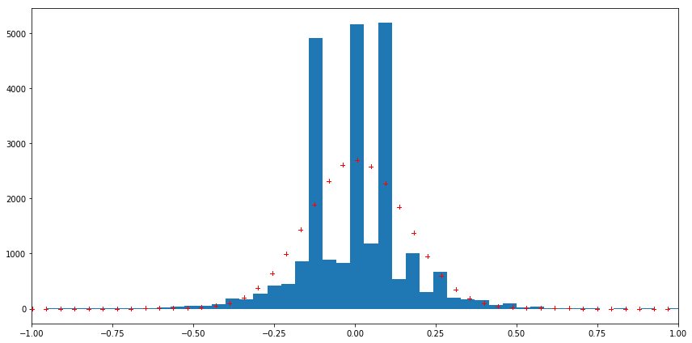
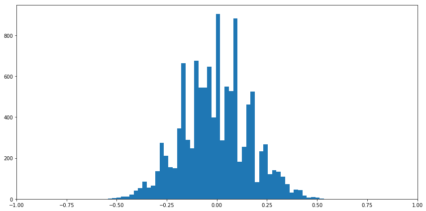
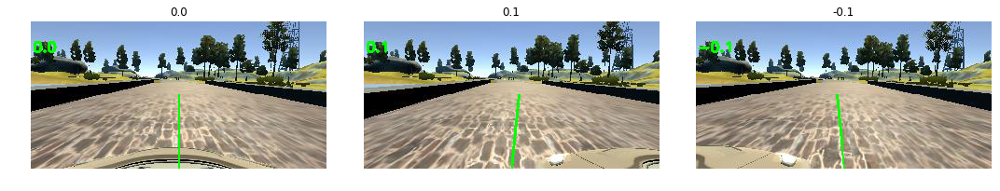
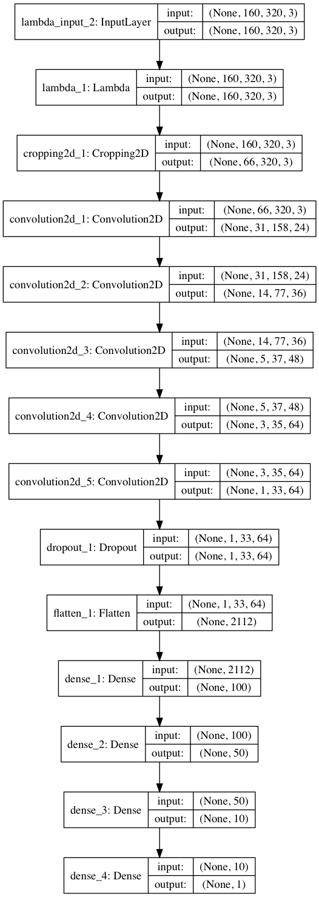
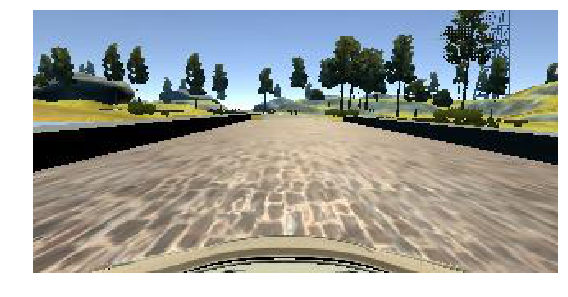
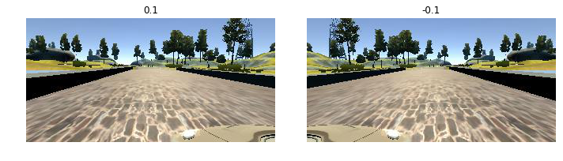
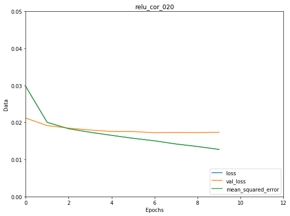
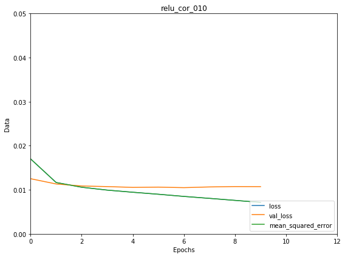

#**Behavioral Cloning** 

##Writeup Template

---

**Behavioral Cloning Project**

The goals / steps of this project are the following:
* Use the simulator to collect data of good driving behavior
* Build, a convolution neural network in Keras that predicts steering angles from images
* Train and validate the model with a training and validation set
* Test that the model successfully drives around track one without leaving the road
* Summarize the results with a written report


[//]: # (Image References)

[image1]: ./examples/placeholder.png "Model Visualization"
[image2]: ./examples/placeholder.png "Grayscaling"
[image3]: ./examples/placeholder_small.png "Recovery Image"
[image4]: ./examples/placeholder_small.png "Recovery Image"
[image5]: ./examples/placeholder_small.png "Recovery Image"
[image6]: ./examples/placeholder_small.png "Normal Image"
[image7]: ./examples/placeholder_small.png "Flipped Image"

## Rubric Points
###Here I will consider the [rubric points](https://review.udacity.com/#!/rubrics/432/view) individually and describe how I addressed each point in my implementation.  

---
###Files Submitted & Code Quality

####1. Submission includes all required files and can be used to run the simulator in autonomous mode

My project includes the following files:
* model.py containing the script to create and train the model
* drive.py for driving the car in autonomous mode
* model.h5 containing a trained convolution neural network 
* writeup_report.md summarizing the results

####2. Submission includes functional code
Using the Udacity provided simulator and my drive.py file, the car can be driven autonomously around the track by executing 
```sh
python drive.py model.h5
```

####3. Submission code is usable and readable

The model.py file contains the code for training and saving the convolution neural network. The file shows the pipeline I used for training and validating the model, and it contains comments to explain how the code works.

###Model Architecture and Training Strategy

####1. An appropriate model architecture has been employed

My model consists of:

- normalization layer ([link](model.py#L54))
- cropping layer to remove the sky and hood of the car ([link](model.py#L56))
- 5 convolutional layers ([link](model.py#L57))
- dropout layer with a keep probability of 0.5 ([link](model.py#L62))
- flattening layer
- 4 dense/fully connected layers with final single-node layer which outputs the steering angle

####2. Attempts to reduce overfitting in the model

The model contains dropout layers in order to reduce overfitting ([link](model.py#L62)) 

The model was trained and validated on different data sets to ensure that the model was not overfitting ([link](model.py#L94). The model was tested by running it through the simulator and ensuring that the vehicle could stay on the track ([link](model.py#L108))

####3. Model parameter tuning

The model used:

- adam optimizer for optimization with learning rate of 1.0e-4 (default is 1.0e-3), to make the model improving validation loss longer ([link](model.py#L82))
- mean squared error for the loss function to measure how precise the model predicts steering angle ([link](model.py#L82))
- ModelCheckpoint to save the model after every epoch with EarlyStopping callback to stop training when a validation loss has stopped improving within 2 epochs ([link](model.py#L129), [link](model.py#L138))

####4. Appropriate training data

Training data was chosen to keep the vehicle driving on the road. I used Udacity dataset to train and validate model in proportion of 80% to train model and 20% to validate. Image augumentation helped me to generate more data for my model to avoid overfitting.
To augment the dataset I've used:

- left image with adjusted steering angle by +0.2
- right image with adjusted steering angle by -0.2
- flip image center/left/right images with inverted steering angle
- image brightness shift
- image channel shift

Left/right images is useful to train the recovery driving scenario, brightness/channel shifts for different lightening conditions.

To reduce the occurrences of low and zero angle data points I adjusted dataset based on histogram with a distribution fit line. Everything above the optimal distribution fit line gets dropped so that I expect to get the car to drive more smoothly (see pictures below)

Input data distribution:



Adjusted data distribution:



For details about how I created the training data, see the next section. 

###Model Architecture and Training Strategy

####1. Solution Design Approach

The overall strategy for deriving a model architecture was to start from the NVIDIA model because it was recommended in classes.

In order to gauge how well the model was working, I split my image and steering angle data into a training and validation set. I found that my first model had a low mean squared error on the training set but a high mean squared error on the validation set. This implied that the model was overfitting. 

To combat the overfitting, I modified the model so that I've added an additional dropout layer to avoid overfitting after the convolution layers and adjusted dataset based histogram distribution fit line.

The final step was to run the simulator to see how well the car was driving around track one. There were a few spots where the vehicle fell off the track where there was a sharp curve and low-contrast roadside. To improve the driving behavior in these cases, I was playing with number of histogram bins which I do use to tune angles and angle correction value for left and right images.

Selected steering angle




At the end of the process, the vehicle is able to drive autonomously around the track without leaving the road.

####2. Final Model Architecture

The final model architecture ([link](model.py#L50)) consisted of a convolution neural network with the following layers and layer sizes:

- normalization layer (160x320x3)
- cropping layer to remove the sky and the car front parts
- 5 convolutional layers
    - Convolution: 5x5, filter: 24, strides: 2x2, activation: RELU
    - Convolution: 5x5, filter: 36, strides: 2x2, activation: RELU
    - Convolution: 5x5, filter: 48, strides: 2x2, activation: RELU
    - Convolution: 3x3, filter: 64, strides: 1x1, activation: RELU
    - Convolution: 3x3, filter: 64, strides: 1x1, activation: RELU
- Dropout (0.5)
- flattening layer (2112 outputs)
- 4 dense/fully connected layers of increasingly smaller size perform classification, the last single-node layer outputs the steering angle
    - 100
    - 50
    - 10
    - 1 (output - the steering angle)

Here is a visualization of the architecture:



####3. Creation of the Training Set & Training Process

To capture good driving behavior, I used Udacity dataset. Here is an example image of center lane driving:



To get more data points I used image augmentation, I also flipped images and angles thinking that this would this would solve the left turn bias problem. For example, here is an image that has then been flipped:




At the beginning I had 24108 number of data points (center, left, right included). I then preprocessed this data by reducing the occurrences of low and zero angle data points I've got 11541 data points.

I finally randomly shuffled the data set and put 20% of the data into a validation set ([link](model.py#L94)) 

I used this training data for training the model. The validation set helped determine if the model was over or under fitting. The ideal number of epochs was 5 as evidenced by no or little improvement of loss after that point (see pictures below)

RELU with 0.20 correlation value


 
RELU with 0.10 correlation value



I used an adam optimizer so that manually training the learning rate wasn't necessary.


## Video
- [Video](video.mp4)
- [Video visualization of convolutional layers](video_featuremap.mp4)
